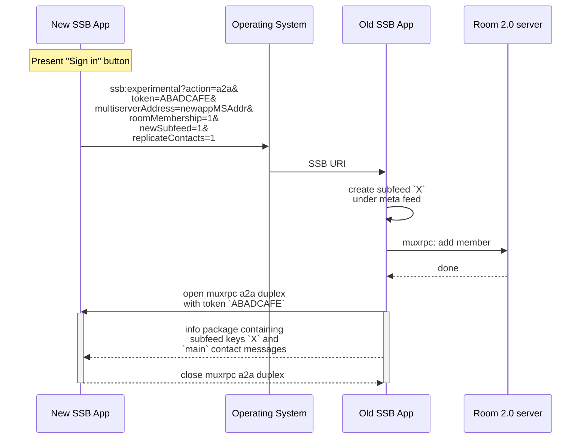
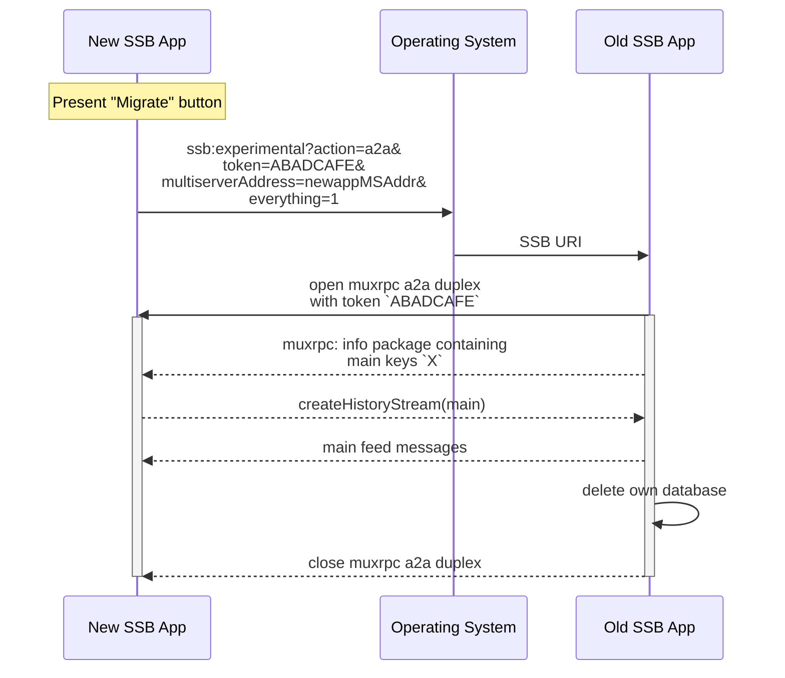
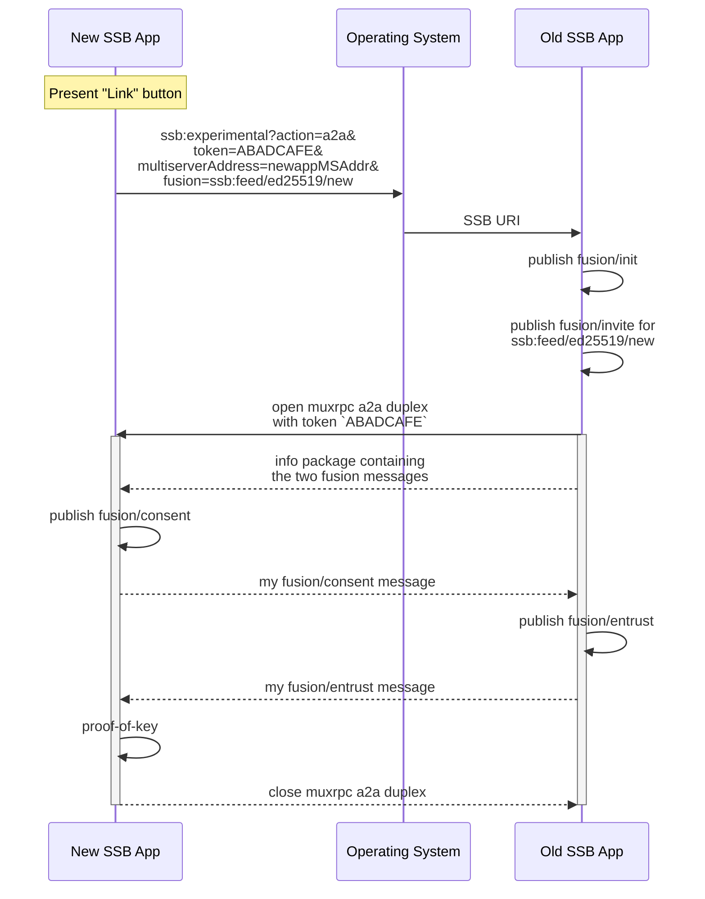

# Examples

## Example 1: subapp

**New app wants to be a subfeed of the root meta feed, AND wants that subfeed to be added as a member in rooms AND wants to partially replicate the main feed (contact graph).**

## Example 2: migration

**New app wants to take over everything from the old app and the old one should be deleted afterwards.**

## Example 3: fusion dance

**New app and old app want to link each other as the same "person".**

